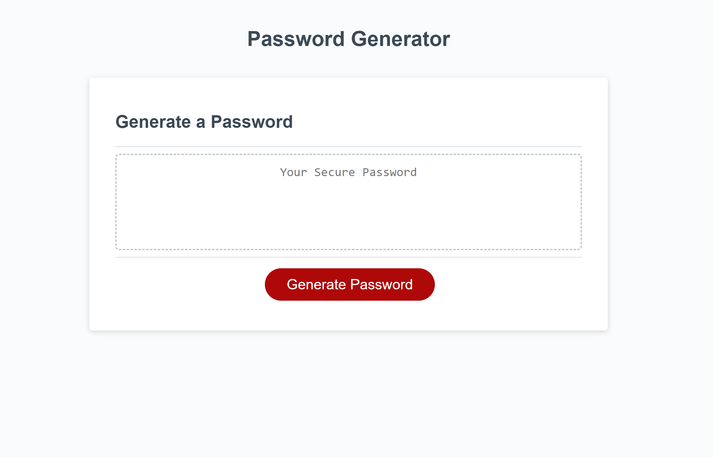
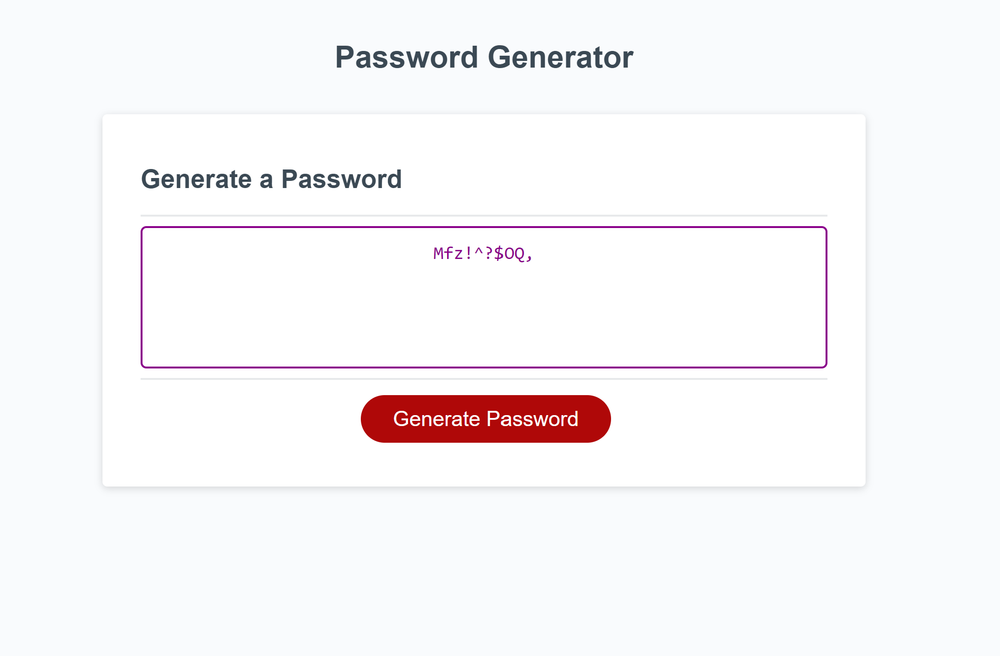

# Password Generator

## Description
The password generator creates a randomly generated password for the user based on the chosen criteria. 

## Installation
link to deployed application: https://malkagreenberg.github.io/Password-Generator

## Usage
When the user clicks on the 'generate password' button a series of prompts pop up the screen. 
The user presses ok or cancel to chose the character types to add to the password, choosing at lease one type.
The user enters a length for the password, choosing a number between 8 and 128. 
The password is then displayed in the box on the screen. 

## Credits

N/A
